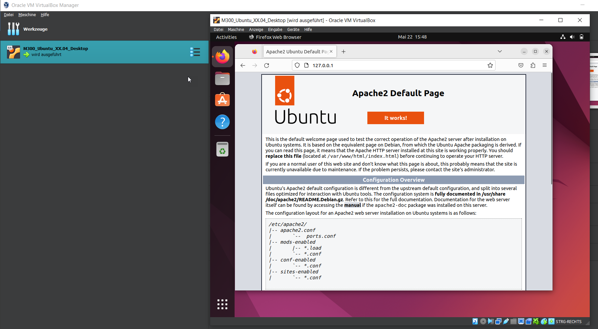
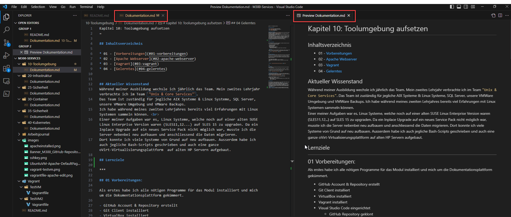

Kapitel 10: Toolumgebung aufsetzen
=

## Inhaltsverzeichnis

* 01 - [Vorbereitungen](#01-vorbereitungen)
* 02 - [Apache Webserver](#02-apache-webserver)
* 03 - [Vagrant](#03-vagrant)
* 04 - [Gelerntes](#04-gelerntes)


## Aktueller Wissenstand
Während meiner Ausbildung wechsle ich jährlich das Team. Mein zweites Lehrjahr verbrachte ich im Team `"Unix & Core Services"`.
Das Team ist zuständig für jegliche AIX Systeme & Linux Systeme, SQL Server, unsere VMWare Umgebung und VMWare Backups.
Ich habe während meines zweiten Lehrjahres bereits viel Erfahrungen mit Linux Systemen sammeln können. <br>
Einer meiner Aufgaben war es, Linux Systeme, welche noch auf einer alten SUSE Linux Enterprise Version waren (SLES11,12...) auf SLES 15 zu upgraden. Da ein Inplace Upgrade auf ein neues Service Pack nicht möglich war, musste ich die Server nebenbei neu aufbauen und anschliessend die Daten migrieren.
Dort konnte ich viele Systeme von Grund auf neu aufbauen. Ausserdem habe ich auch jegliche Bash-Scripts geschrieben und auch eine ganze oVirt-Virtualisierungsplattform  auf alten HP Servern aufgebaut.

## Lernziele

***

## 01 Vorbereitungen:

Als erstes habe ich alle nötigen Programme für das Modul installiert und mich um die Dokumentationsplattform gekümmert.

- GitHub Account & Repository erstellt
- Git Client installiert
- VirtualBox installiert
- Vagrant installiert
- Visual Studio Code eingerichtet
  - GitHub Repository geklont
  - Markdown Extension installiert & zweites Fenser mit MD Preview


> ### SSH Key
> Damit ich über SSH auf mein Repository zugreifen kann, habe ich lokal ein SSH Key-Pair erstellt und den Public Key in meinem GitHub Account hinterlegt:
> 
> 

***
<br>

## 02 Apache Webserver 
Nach dem ich alle Vorbereitungen erledigt habe und mich mit Git vertraut machen konnte habe ich mit dem Einrichten der Ubuntu VM für den Webserver begonnen.

Als erstes habe in VirtualBox die ISO angehängt und Ubuntu manuell installiert. Danach habe ich die Repos und Pakete aktualiert und anschliessend den Apache Webserver installiert.

```
$ sudo apt-get install apache2
$ sudo systemctl status apache2 # status des Webservers
$ sudo systemctl enable apache2 # apache soll automatisch nach dem reboot starten
```
<br>





***
<br>

## 03 Vagrant
Zur automatisierten Erstellung und Verwaltung von VMs, habe ich das Prgramm Vagrant installiert.

> Für jede VM erstelle ich einen weiteren Ordner im Verzeichnis ../Vagrant/

Als erstes habe ich zum testen einen TestVM Ordner erstellt. Danach habe ich ein Vagrant File erstellt und die VM wie folgt erstellt:


### Apache automatisch aufsetzen
- Im nächsten Schritt habe ich einen für eine zweite TestVM nochmals einen Ordner erstellt und das Vagrant File so angepasst, dass bei der VM installation der Apache Webserver direkt mitinstalliert wird.


- Und wir sehen, apache konnte erfolgreich installiert werden.
```
$ systemctl status apache2
○ apache2.service - The Apache Webserver
     Loaded: loaded (/usr/lib/systemd/system/apache2.service; disabled; vendor preset: disabled)
     Active: inactive (dead)
```

## 04 Gelerntes

Da ich bereits im Vorfeld Erfahrungen mit Linux Systemen sammeln konnte, viel mir der Einstieg in dieses Modul nicht so schwer. <br>
Ich habe jedoch zum ersten Mal mit Vagrant gearbeitet und finde dieses Tool sehr spannend. Man kann innerhalb kurzer Zeit ganze virtuelle Umgebungen aufziehen und diese ganz einfach via Command Shell verwalten. <br>
Ich hatte bis jetzt auch sehr wenig Erfahrung mit Git Repos und mit Markdown. Ich würde sagen ich finde mich mittlerweile gut zurecht und konnte meine Arbeitsumgebung gut optimieren, sodass ich mein Git Repo und meine Aufträge leicht bearbeiten kann.
> ### Tipp: 
> Mit ***Ctrl+Shift+V*** kann man in VS Code ein Markdown Preview Fenster anzeigen.  So kann man in Echzeit die gerenderte Markdown Version anschauen.
> 
