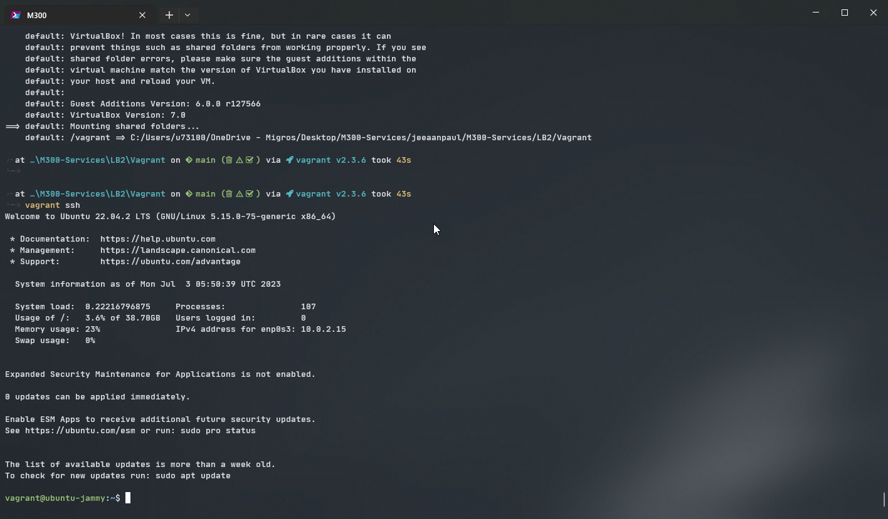
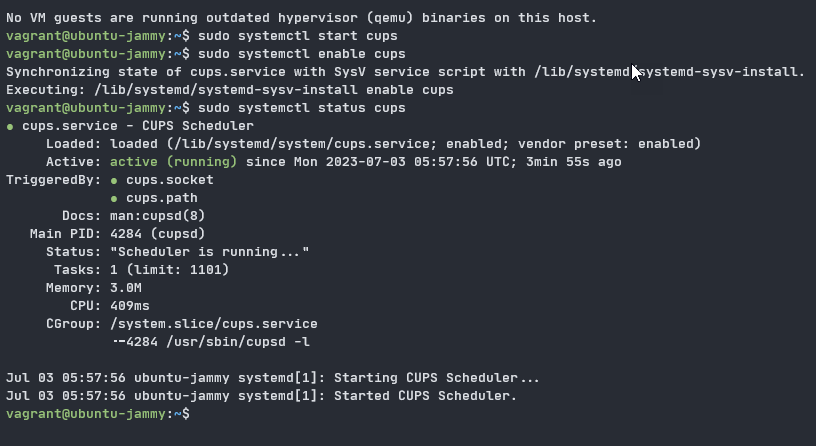
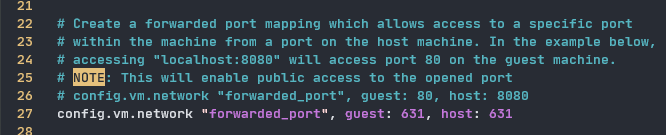
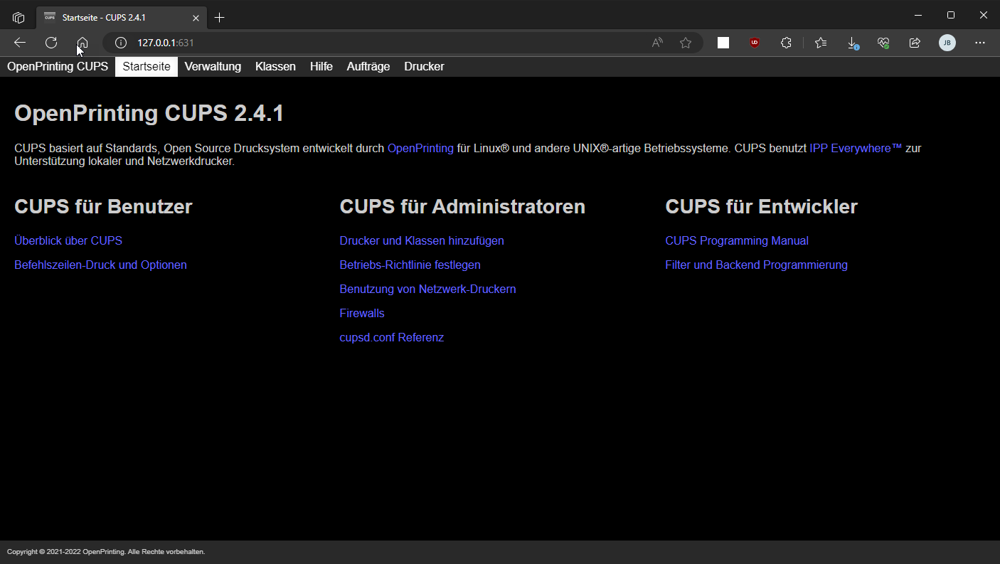
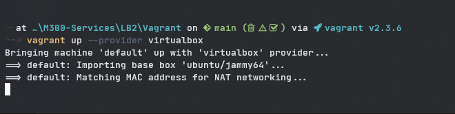
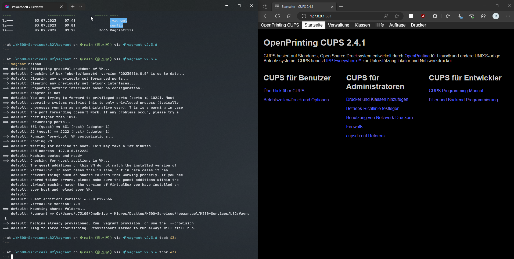
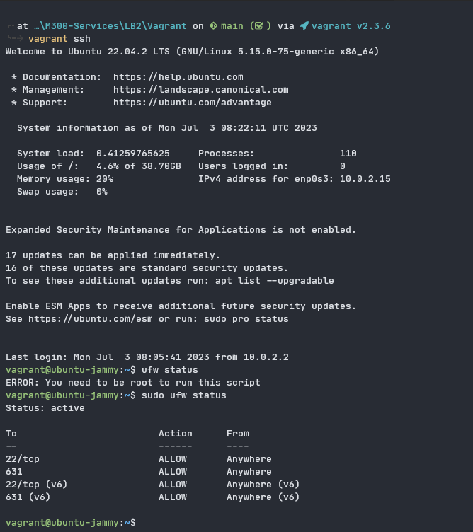
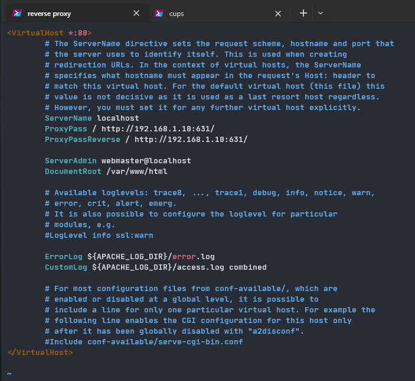
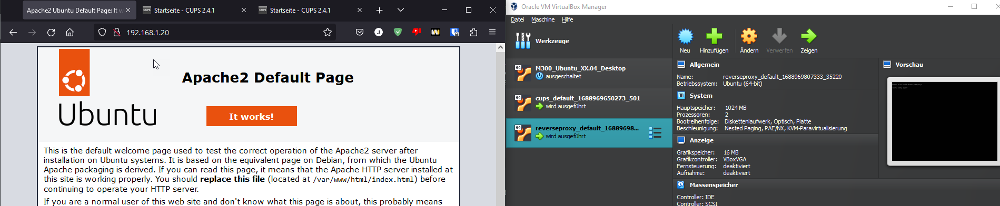
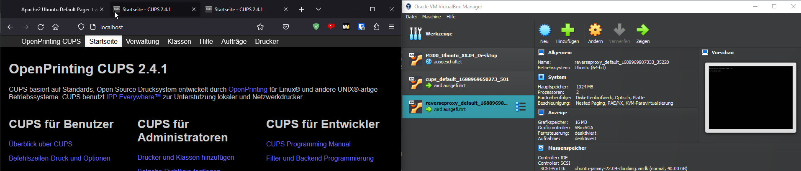

LB2
===

# Übersicht

Die LB2 deckt die Kapitel [20-Infrastuktur](../20-Infrastruktur/) und [25-Sicherheit](../25-Sicherheit/). <br>

Für die Automatisierung eines Serverdienstes habe ich mich für CUPS entschieden. Mit CUPS können wir einen Printserver einrichten, der Printjobs annimmt und sie an die jeweiligen Printerqueues sendet. <br>

## Aktueller Wissenstand:
Ich habe bereits während meines zweiten Lehrjahrs im Unix Team verschiedene Serverdienste zum Testen installieren müssen. Dort habe ich auchschon einmal den CUPS Printerdienst installiert und eine Print2PDF Queue eingerichtet, mit dem ich dann von einem anderen Gerät Dateien als PDF speichern konnte.

Das Vagrantfile befindet sich im Ordner ``Vagrant\LB2``. <br>

Als Hilfe, habe ich folgende Dokumentation verwendet: <br>
https://www.fosslinux.com/61850/how-to-set-up-cups-print-server-on-ubuntu.htm
*** 

# Installation

### Vorbereitung:

Für diese LB habe ich das Verzeichnis ``LB2`` erstellt. <br>
Ich verwende Ubuntu als Distribution:

```pws
vagrant init ubuntu/jammy64
```

Jetzt erstelle ich das Verzeichnis ``.\config``. <br>
Dort speichere ich dann das Config File für CUPS, damit beim Starten der Vagrantbox die VM bereits konfiguriert ist.

```pws
mkdir config
```
### VM einmal manuell erstellen & das Vagrantfile vorbereiten:
```pws
vagrant up
```


> Alle ausgeführten Commands dokumentiere ich mir nebenbei im Notepad und fasse sie dann im Vagrantfile zusammen...
> <br>
> **Wichtig:** Bei manchen Commands braucht es Userinput zur Bestätigung wie z.B ein `y` bei apt install xx. Damit ich bei der Automatisierung den Userinput umgehen kann, gebe ich die richtigen Parameter gleich mit wie zum Beispiel `-y` bei `sudo apt install cups`.
<br>



So, der CUPS Dienst ist jetzt installiert, gestartet und er läuft einwandfrei <br>

Als nächstes können wir CUPS so konfigureren, damit wir ihn auch über das Webinterface erreichen und einrichten können:

```bash
vagrant@ubuntu-jammy:~$ sudo vi /etc/cups/cupsd.conf
```

Hier ist der Output von den Blöcken, welche ich bearbeitet habe:

```bash
vagrant@ubuntu-jammy:~$ cat /etc/cups/cupsd.conf
...
# Only listen for connections from the local machine.
port 631
Listen /run/cups/cups.sock

# Show shared printers on the local network.
Browsing On
BrowseLocalProtocols dnssd

# Show shared printers on the local network.
Browsing On
BrowseLocalProtocols dnssd

# Restrict access to the server...
<Location />
  Order allow,deny
  Allow @LOCAL
</Location>

# Restrict access to the admin pages...
<Location /admin>
 AuthType Default
 Require valid-user
 Order allow,deny
 Allow @LOCAL
</Location>
...
```

Danach habe ich den Dienst nochmals neu gestartet:

> ## Erstes Problem:
> Ich habe versucht von meinem Hostsystem aus auf das CUPS Interfac zuzugreiffen, jedoch ohne Erfolg. <br>
> Das Problem war die Portweiterleitung. Damit ich auf das Webinterface von CUPS zugreifen kann muss ich das erst im Vagrantfile definieren. <br>
> 

Jetzt wo ich das Konfigurationsfile angepasst habe und das Vagrantfile auch stimmt, versuche ich auf das Webinterface zuzugreiffen:



Super, es hat funktioniert!

### Vagrant File und Config vorbereiten:
Im nächsten Schritt habe ich das CUPS config file vollständig kopiert und im Verzeichnis ``.\Vagrant\config\cupsd.conf`` abgelegt. <br>
Jetzt muss ich noch alle wichtigen Commands dem Vagrantfile hinzufügen und überprüfen, dass das Config file ersetzt wird. <br>

```ruby
config.vm.provision "shell", inline: <<-SHELL
  sudo apt-get update
  sudo apt-get install -y cups
  sudo systemctl start cups
  sudo systemctl enable cups
  sudo cp /vagrant/config/cupsd.conf /etc/cups/cupsd.conf
  sudo systemctl restart cups

SHELL
end
```

### Testen ob alles funktioniert:

Für den Test ob alles läuft, habe ich die VM nochmals destroyed mit `vagrant destroy -f` und anschliessend nochmals neu erstellt mit `vagrant up`.



Und wie wir im folgenden Screenshot sehen funktioniert alles:



<br>

# Sicherheit
Im nächsten Schritt versuchen wir unsere Vagrant Umgebung im Thema Sicherheit zu optimieren. <br>

Bei der Installation von Ubuntu wird standartmässig die ufw Firewall direkt mitinstalliert. Mithilfe von ufw können wir den Zugriff von Aussen und von Innen nach Aussen regulieren. <br>

In diesem Fall möchten wir **SSH** und den **Port 631** erlauben, da wir 1. auf die VM zugreiffen möchten um allenfall Änderungen durchzuführen und 2. da unser CUPS Dienst den Port 631 für das Webinterface benötigt. <br>

Falls später neue Dienste dazukommen, kann man die Firewall Rules jederzeit erweitern. <br>

```bash
vagrant@ubuntu-jammy:~$ sudo ufw allow ssh
Rule added
Rule added (v6)
vagrant@ubuntu-jammy:~$ sudo ufw allow 631
Rule added
Rule added (v6)
vagrant@ubuntu-jammy:~$ sudo ufw default deny incoming
vagrant@ubuntu-jammy:~$ sudo ufw enable
Command may disrupt existing ssh connections. Proceed with operation (y|n)? y
Firewall is active and enabled on system startup
vagrant@ubuntu-jammy:~$ sudo ufw status
Status: active

To                         Action      From
--                         ------      ----
22/tcp                     ALLOW       Anywhere
631                        ALLOW       Anywhere
22/tcp (v6)                ALLOW       Anywhere (v6)
631 (v6)                   ALLOW       Anywhere (v6)

```

All diese Commands füge ich noch dem Shell Script im Vagrantfile hinzu, damit der Zugriff schon beim erstellen der VM geregelt ist.

```ruby
config.vm.provision "shell", inline: <<-SHELL
  sudo apt-get update
  sudo apt-get install -y cups
  sudo systemctl start cups
  sudo systemctl enable cups
  sudo cp /vagrant/config/cupsd.conf /etc/cups/cupsd.conf
  sudo systemctl restart cups
  sudo ufw allow ssh
  sudo ufw allow 631
  sudo ufw default deny incoming
SHELL
end
```

Nach und wir sehen nachdem Starten der Vagrantbox sind auch die Firewall Rules aktiv.


> Da unsere Umgebung nur aus einem System besteht macht es keinen Sinn einen Reverse Proxy einzurichten. Im Fall einer grösseren VM Umgebung, würde ein Reverse Proxy aus sicherheitsgründen Sinn machen.

<br>

## Reverse Proxy
***
### Übersicht:
Ein Reverse Proxy dient dazu mehrere Systeme hinter einem System zu verbergen. Man stellt sozusagen nur den Reverse Proxy nach aussen und reguliert von dort aus den Zugriff und die Last auf den Servern. <br>

In diesem Fall haben wir jedoch nur unseren Cups Server, jedoch reicht dies aus, um die Funktion des Reverse Proxy Servers zu demonstrieren. <br>

### CUPS Netz Config:
Davor haben wir unsere CUPS VM genattet und eine Portweiterleitung eingerichtet, wodurch wir von unserem Host System direkt auf das Webinterface zugreiffen konnten als würde der Dienst auf dem Host laufen. <br>

Für den nächsten Schritt stellen wir den CUPS Server in ein privates Netzwerk und vergeben ihm eine eigene IP-Adresse.

```ruby
config.vm.network "private_network", ip: "192.168.1.10", netmask: "255.255.255.0
```

### Reverse Proxy:

Jetzt richten wir unsere Apache Reverse Proxy ein. <br>
Die VagrantBox liegt unter `LB2\reverseproxy`. <br>

Ich habe die VagrantBox wie immer zuerst einmal manuell erstellt und alles eingerichtet. Folgende Shell-Commands werden nacher im Vagrantfile definiert: <br>

```bash
sudo apt-get install libapache2-mod-proxy-html libxml2-dev -y
sudo a2enmod proxy
sudo a2enmod proxy_html
sudo a2enmod proxy_http
echo "ServerName localhost" | sudo tee -a /etc/apach2/apache2.conf
sudo cp /vagrant/config/reverse-proxy.conf /etc/apache2/sites-available/reverse-proxy.conf
sudo a2ensite reverse-proxy.conf
sudo systemctl restart apache2
```

#### Netz Config:

```ruby
config.vm.network "forwarded_port", guest: 80, host: 80 

# Create a private network, which allows host-only access to the machine
# using a specific IP.
config.vm.network "private_network", ip: "192.168.1.20", netmask: "255.255.255.0
```

### Apache2 conf

Damit apache die Anfragen an das CUPS Webinterface weiterleitet, müssen wir dies zuerst noch die config anpassen. <br>

Dafür erstelle ich das file `/etc/apache2/sites-available/reverse-proxy.conf`. <br>

Unter `ServerName` definiere ich, wie ich den Reverse Proxy erreiche und unter `ProxyPass` und `ProxyPassReverse`, an welche Adresse der Reverse Proxy die Anfrage weiterleiten soll. (In unserem Fall das Cups Interface: 192.168.1.10:631) <br>



## Ergebnis:
Nachdem ich alles konfiguriert habe starte ich beide Vagrantboxen von neu.


<br>
Wir sehen, es hat funktioniert. Im ersten Bild rufen wir die IP des Reverse-Proxys auf und die default Apache Seite erscheint. Wenn wir aber `localhost` eingeben wie wir in der config definiert haben, werden wir schön auf das CUPS Webinterface weitergeleitet.

# Reflexion
Ich habe während der LB2 einige Sachen dazu gelernt. Z.B wusste ich nicht, dass ich die Portweiterleitung im Vagrantfile deklarieren muss, damit der Zugriff von meinem Hostsystem auf die VM funktioniert. Ausserdem hatte ich davor nur Erfahrungen mit SUSE Linux und RedHat based Distributionen wie AlmaLinux, Fedora, CentOS usw, welche alle **.rpm** Pakete verwenden und nicht **.deb**. Daher gab es auch einige Unterschiede mit den Kommandos und Parametern und auch mit den Binaries der installierten Paketen. Ich musste vieles nochmals nachschauen da ich nicht daran gewohnt war. Aber ich habe mich auch extra dafür entschieden, einmal auf einer ganz anderen Distribution zu arbeiten als ich sonst gewohnt bin. <br>
