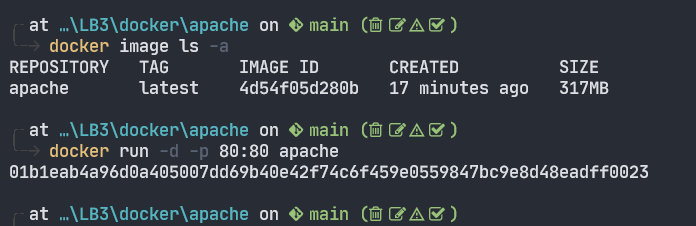
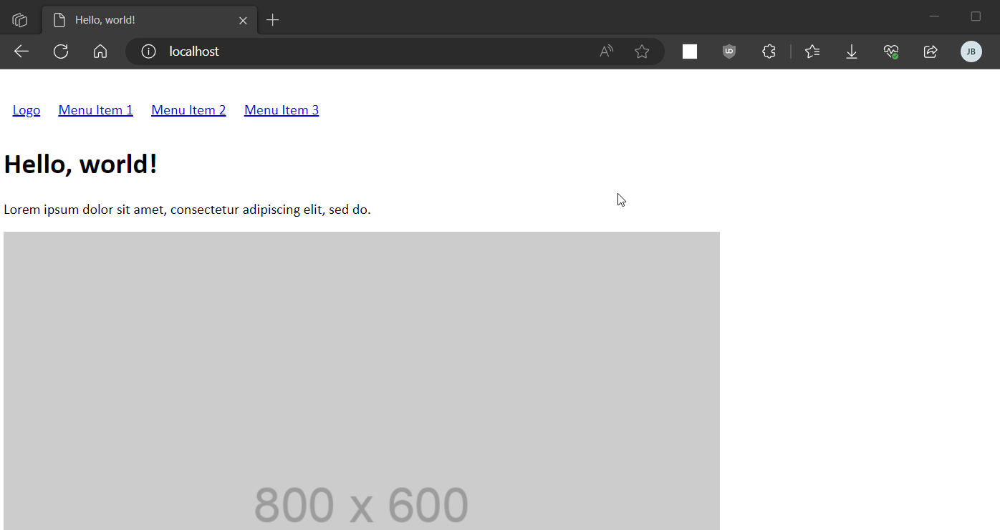

LB3
===

# Übersicht
Die LB3 deckt die Kapitel [30-Container](../30-Container/) und [25-Sicherheit](../35-Sicherheit/). <br>

Ich habe Docker lokal auf meinem Host-System installiert. Als automatisierten Service habe ich Apache ausgewählt. <br>
Der Container liegt im Verzeichnis `LB3\docker\apache`.

## Aktueller Wissensstand:
Im Lehrbetrieb arbeite ich zurzeit an einem Projekt, bei dem ich Ansible für Windows teste. Ansible ist bei uns bereits in unserer Linux Server Umgebung im Einsatz und wird vom Unix Team gemanaged. Ich baue zurzeit einen Ansible Container, der dann später mit unseren Windows Nodes kommunizieren soll. Dort versuche ich das Prinzip von "Infrastructure as Code" anzuwenden und Ansible in einer Code definierten Umgebung aufzubauen. <br>

# Installation

## Dockerfile
Als Basis für mein Dockerfile habe ich mein eigenes File genommen, welches ich schon für andere Projekte verwendet habe. <br>

Ich verwende als OS Almalinux.

Mein Dockerfile:

```dockerfile
FROM almalinux:latest
LABEL description="AlmaLinux 9 Apach2"
LABEL maintainer="Jean-Paul Bitschnau <jean-paul.bitschnau@outlook.com"

ENV LC_CTYPE=en_US.UTF-8
ENV TIME_ZONE=Europe/Zurich

# ENV Settings
ENV HISTFILE=/mnt/bash-history.txt

# Install and Update
RUN echo "sslverify=false" >> /etc/yum.conf
RUN dnf install -y bash sudo vim-enhanced wget httpd httpd-tools \
    && dnf update -y

# Ports
EXPOSE 80

# http index file
ADD web/index.html /var/www/html/index.html

# Start Apache when the container starts
CMD ["httpd", "-D", "FOREGROUND"]
```

### Probleme:
Am Anfang konnte ich keine Pakete installieren. Ich hatte das Problem, dass ich die Keys der Repos nicht hinterlegt hatte und deswegen ein SSL trust Fehler kam. <br>
Das Problem konnte ich einfach lösen, indem ich im `/etc/yum.conf` File definiert habe, dass man das Zertifikat ignorieren kann. <br>
Ausserdem kopiere ich das index file gleich ins image, da das kein produktiver Container ist, ansonsten würde man das im docker-compose file definieren. <br>

> ### Grundsätzlich gilt:
> * Dockerfile --> Alles was beständig ist wie Pakete die installiert werden müssen... <br>
> * docker-compose file --> Alles was sich dynamisch verändert, wie z.B gemappte Filesysteme, Keyvaults/ Credentials usw...

<br>


Wir sehen, ich konnte meinen Container erfolgreich starten:



Output:
```bash
╭╴at …\LB3\docker\apache on  main (    )
╰─ docker ps -a
CONTAINER ID   IMAGE     COMMAND                 CREATED         STATUS         PORTS                NAMES
01b1eab4a96d   apache    "httpd -D FOREGROUND"   5 minutes ago   Up 5 minutes   0.0.0.0:80->80/tcp   happy_stonebraker
```

# Reflexion
Während der LB3 habe einige Dinge dazu gelernt. Ich war mir vorher z.B noch unsicher über den Unterschied zwischen dem Dockerfile, dem docker-compose file und dem Entrypoint, was ich weiter oben erklärt habe. Ich hatte vorallem Schwierigkeiten mit dem Zeitmanagemend aufgrund von Absenzen und da ich dann die LB2 noch fertig machen musste. Ich habe vieles aufgeschoben, weshalb ich gegen Ende nicht alles geschafft habe, was ich von mir selbst erwartet hätte. Ich hatte Schwierigkeiten mit dem deployen von Überwachungslösungen und aufgrund von fehlender Pufferzeit konnte ich das auch nicht mehr lösen. Beim nächsten Mal muss ich mich besser organisieren. Auf jeden Fall hat mir das Modul bis jetzt am meisten Spass gemacht, weil das Modul sehr den Aufträgen im Geschäft ähnelt und mich das Thema auch selber sehr interessiert. Das Modul baut ein gutes Fundament im Bereich Linux, Container/Virtualisierung und IaS.